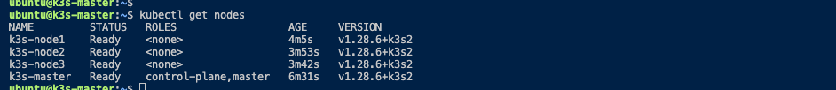

# multipass-k3s-setting
Script to set up the k3s environment in multipass.
Available in Mac OS environment.

## Requirements
- Multipass must be installed
- Shell scripts must be available

## How to use
- Run ‘run.sh’
- $ multipass shell k3s-master

## Sequence

1. Enter configuration values (if not entered, default values will be used) 
    - If you do not have an ssh pubkey, you will need to create one.
2. Create master and work node instances with Multipass.
3. Install k3s on each instance.